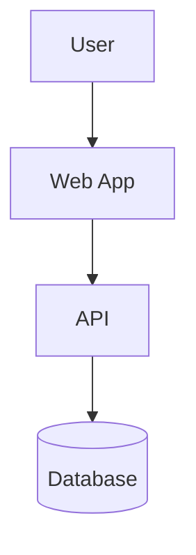

# Diagram Creator Skill

## Purpose
This skill helps the assistant produce Mermaid diagrams inside Markdown files. It is pushy about triggering: if a user asks to "create a diagram", "draw a flowchart", "make architecture diagram", or similar, the assistant should consult this skill.

## When to trigger
- User asks to create any kind of diagram (flowchart, sequence, class, state, gantt, graph, journey, or architecture). 
- User asks to embed a diagram in a Markdown file or requests an output that benefits from a visual diagram.

## Expected output
- A Markdown snippet containing a fenced code block with language `mermaid` and valid Mermaid syntax.
- If a target Markdown file is available, the skill should insert the diagram into that file (following user placement preference). If no file exists, the skill must ask where to create it before writing.

## Trigger phrases (examples)
- "Create a diagram for the deployment flow"
- "Draw a mermaid flowchart for this README"
- "Add a sequence diagram to the architecture.md"
- "Make a Mermaid class diagram from this description"

## Behaviour / Instructions for the model
1. If the user provides an existing Markdown file path or open file context, use it. Insert the diagram at the user's requested location (top, bottom, inline after a heading, or replace a placeholder). If unspecified, ask: "Do you want the diagram added to [path] or a new file?"
2. If no Markdown file is provided and none can be found from context, politely ask: "Where should I create the Markdown file for the diagram?" Provide a suggested filename (e.g., `diagram.md` or `{topic}-diagram.md`).
3. Produce only valid Mermaid syntax inside a fenced block. Include a short one-line caption or heading above the block if the user requests titles. Example output:

```markdown
## Deployment flow


```

4. When possible, keep diagrams concise and add comments (Mermaid supports `%%` comments) to explain non-obvious nodes.
5. If the user provides data (CSV, lists of steps, endpoints), convert it into nodes/links programmatically and present the Mermaid code as well as a brief explanation of mapping choices.

## Output format rules
- ALWAYS present the Mermaid block wrapped in triple backticks with `mermaid` as the language. Do not wrap the file path or code block in inline code markers when speaking about them.
- If writing to a file, write the full Markdown content (including heading and fenced block) to the file.

## Examples

**Example 1 — flowchart from a short description**
User: "Create a diagram for: user logs in -> frontend -> auth service -> database"

Assistant should produce a Markdown snippet with a `flowchart TD` block mapping each element to nodes and arrows.

**Example 2 — insert into existing file**
User: "Add a sequence diagram to `docs/architecture.md` after the 'Auth Flow' heading."

Assistant: confirm file exists (or ask), then insert a `sequenceDiagram` mermaid block after the heading.

## Test prompts (suggested)
1. "Create a flowchart mermaid diagram for: User -> Web -> API -> DB. Put it in `docs/diagrams/auth.md`."
2. "Draw a sequence diagram showing: Browser requests page, Server returns HTML, Browser requests API, Server returns JSON." (no file specified — skill should ask where to create it)
3. "Make a class diagram for these components: User (id, name), Post (id, title, author_id), Comment (id, post_id, author_id)."

Save these prompts into `evals/evals.json` when running tests.

## Evals template example
Create `evals/evals.json` with this structure (replace fields as needed):

```json
{
  "skill_name": "diagram-creator",
  "evals": [
    {
      "id": 1,
      "prompt": "Create a flowchart mermaid diagram for: User -> Web -> API -> DB. Put it in docs/diagrams/auth.md",
      "expected_output": "A Markdown file at docs/diagrams/auth.md containing a mermaid flowchart code block",
      "files": ["docs/diagrams/auth.md"]
    }
  ]
}
```

## Running test cases (process)
1. Save evals to `evals/evals.json` in the skill workspace.
2. For each eval, run a with-skill and without-skill pair (see skill-creator README). Save outputs into `iteration-1/` directories.
3. While runs proceed, draft assertions to check: file created, mermaid fenced block present, valid mermaid code (basic syntax checks), placement correct.
4. Use `eval-viewer/generate_review.py` to produce the review HTML and ask the user to inspect and provide feedback.

## Compatibility notes
- The skill writes Markdown files and Mermaid code only; rendering is handled by the user's Markdown viewer or CI. Do not attempt to render images or SVGs server-side.

## Safety and scope
- Do not generate any code that executes arbitrary shell commands or fetches external resources without explicit user permission.

---
If you'd like, I can now: (1) create `evals/evals.json` with the sample prompts, (2) run the test scaffolding (spawn runs), or (3) open the new SKILL.md for review. Which would you like next?
