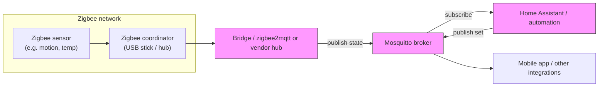

# Zigbee, MQTT, and Mosquitto — Quick Primer

## Zigbee

Zigbee is a low-power, low-bandwidth wireless mesh protocol for short-range IoT devices such as sensors, switches, and bulbs. Devices form a mesh network using a coordinator/router/end-device model. Zigbee is designed for constrained hardware and local, energy-efficient communication.

## MQTT

MQTT (Message Queuing Telemetry Transport) is a lightweight publish/subscribe messaging protocol widely used in IoT. Clients publish messages to named topics and subscribe to topics via a broker. MQTT is efficient over unreliable or low-bandwidth networks and decouples producers from consumers.

Designed in 1999 by Andy Stanford-Clark (IBM) and Arlen Nipper (Eurotech) for battery-powered sensors over satellite links, it was standardised by OASIS in 2013. Today it is used in home automation, industrial monitoring, agriculture, and vehicle telematics. MQTT v3.1.1 (2014) remains widely deployed; MQTT 5 (2019) added significant enhancements.

### Topics

Messages are routed via UTF-8 topic strings, structured like folder paths:

```
home/kitchen/temperature
home/livingroom/humidity
```

Subscribers can use wildcards:
- `+` — single-level wildcard (e.g. `home/+/temperature` matches any room)
- `#` — multi-level wildcard (e.g. `home/#` matches everything under `home/`)

Topic naming guidelines: use ASCII only, avoid spaces, avoid a leading `/`, and do not use names starting with `$` (reserved for broker system topics such as `$SYS`).

### Quality of Service (QoS)

MQTT defines three delivery guarantees, set independently for publishing and subscribing:

| Level | Name | Behaviour |
|-------|------|-----------|
| QoS 0 | At most once | Fire-and-forget; no acknowledgement; possible loss |
| QoS 1 | At least once | Acknowledged; retransmits until confirmed; may deliver duplicates |
| QoS 2 | Exactly once | Four-step handshake; guaranteed single delivery; highest overhead |

Brokers support **persistent sessions**: QoS 1 and QoS 2 messages are queued for disconnected clients and delivered when they reconnect.

### Retained Messages

Setting the retain flag on a published message instructs the broker to store that message. New subscribers immediately receive the latest retained value for a topic, rather than waiting for the next publish. Only one retained message is stored per topic; timestamps must be embedded in the payload by the publisher.

### Last Will and Testament (LWT)

A client can register an LWT message at connection time — a topic, payload, and QoS. If the broker detects an abnormal disconnect (crash, network drop, power loss), it publishes the LWT on the client's behalf. Useful for device-health monitoring and automated failover.

### Payload Formats

MQTT does not prescribe a payload format. Common choices:
- **Plain text** — single values (`23.1`), commands (`ON`), or CSV
- **JSON** — structured data, human-readable (e.g. `{"temp": 23.1, "humidity": 41}`)
- **Binary** — images, audio, sensor streams, OTA firmware

### MQTT 5 Highlights

MQTT 5 (2019) added features relevant to home automation and larger deployments:
- **Message/session expiry** — drop stale QoS 1/2 messages after a configurable timeout
- **User properties** — custom key-value metadata in message headers
- **Shared subscriptions** — load-balance a topic across a group of consumers (`$share/groupname/topic`)
- **Improved request/response** — correlation data enables direct reply routing
- **Better error reporting** — reason codes and enhanced authentication flows

## Mosquitto

Eclipse Mosquitto is a popular open-source MQTT broker (server). It receives client messages, enforces authentication/TLS, persists and forwards messages, and supports MQTT v3/v5. Mosquitto is commonly run on small servers or Raspberry Pi devices in home automation setups.

## How they work together in home automation

Zigbee devices do not speak MQTT directly. Instead, they connect to a local Zigbee coordinator (a USB stick or hub). A gateway or bridge service (for example `zigbee2mqtt` or a vendor hub) translates Zigbee messages into MQTT topics and publishes them to an MQTT broker such as Mosquitto. Home automation platforms (e.g., Home Assistant) subscribe to the broker to read device state and to publish commands.

## Example flow

- Zigbee sensor → Zigbee coordinator
- Coordinator/bridge (e.g., `zigbee2mqtt`) → publishes to Mosquitto topics
- Mosquitto broker → distributes messages
- Home automation software → subscribes and triggers automations

## Practical notes

- **TLS encryption**: MQTT transmits credentials in plaintext by default. Always enable TLS for connections on untrusted networks; use certificates from a trusted CA (e.g. Let's Encrypt). For stronger identity verification, use mutual TLS requiring both broker and client to present valid certs.
- **Authentication & ACLs**: Assign usernames and passwords to clients, but combine with Access Control Lists (ACLs) to restrict which clients can publish or subscribe to which topics.
- **Rate and size limits**: Configure message rate and size limits on the broker to mitigate denial-of-service attacks.
- **Data persistence**: Brokers are lightweight routers, not databases. For historical data (dashboards, analytics), subscribe a bridge app to relevant topics and store messages in a time-series database (InfluxDB, PostgreSQL, etc.).
- **Client ID uniqueness**: Each client must use a unique Client ID (up to 256 UTF-8 chars). Duplicate IDs cause the broker to disconnect the older session — a common source of unexpected disconnects.
- Keep Zigbee coordinator firmware up to date for reliability and security.
- Choose between native Zigbee integrations (directly supported by your automation platform) and MQTT bridges depending on flexibility and architectural preferences.

This primer covers the common roles each technology plays, key MQTT concepts (topics, QoS, retained messages, LWT, MQTT 5), and a typical integration pattern for DIY home automation. Source: [Shawn Hymel — What is MQTT?](https://shawnhymel.com/3046/what-is-mqtt-an-introduction-to-the-lightweight-iot-messaging-protocol/) (November 2025).

## Diagram



The diagram shows Zigbee devices communicating with a local coordinator; a bridge converts Zigbee messages into MQTT topics that Mosquitto (the broker) distributes to Home Assistant and other subscribers.
