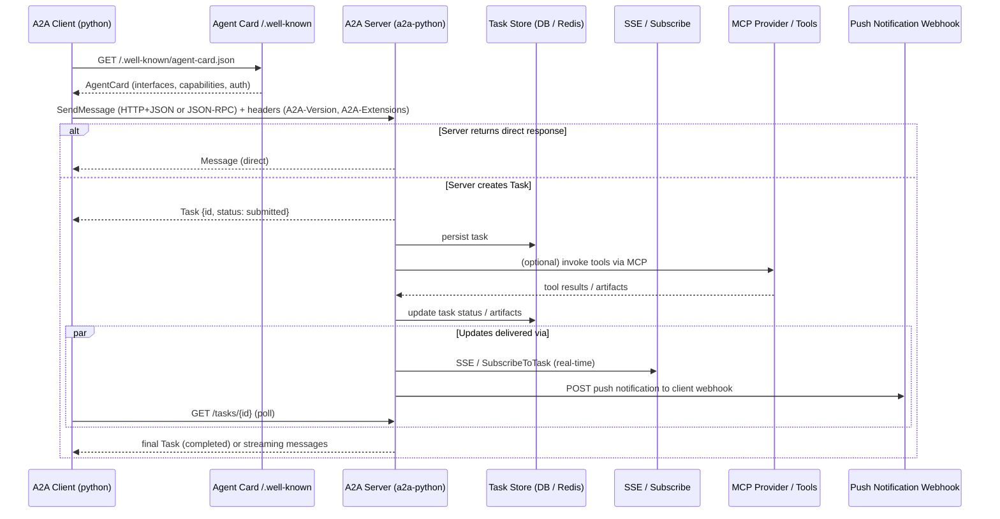

# A2A Protocol — Python SDK (overview)

This file visualizes the Agent2Agent (A2A) protocol interaction patterns as implemented/used by the official A2A Python SDK (a2a-python) and the A2A specification.

Key notes:

- Discovery: clients fetch the AgentCard to learn bindings (JSONRPC / HTTP+JSON / gRPC), capabilities (streaming, pushNotifications), and auth requirements.
- Bindings: A2A supports JSON-RPC over HTTP(S), HTTP+JSON/REST, and gRPC; streaming is delivered via Server-Sent Events for HTTP bindings.
- Client must include `A2A-Version` and may include `A2A-Extensions` headers; authentication follows the AgentCard's declared schemes.
- Tasks: a2a-python persists tasks (DB/Redis/Vertex) and supports returning either a direct Message or a Task object (async processing).
- Updates: clients receive updates via polling (`GetTask`), streaming (`SubscribeToTask` / SSE), or push notifications (webhooks).
- MCP: A2A servers commonly use MCP providers to execute tool calls; the server aggregates MCP results into task artifacts before returning/updating the client.

Note on Python SDK `send_message` behavior:

- The official `a2a-python` SDK consolidates streaming and non-streaming paths into the single `Client.send_message` API. It returns an async iterator of update events or a direct `Message` and will automatically use streaming when the server/AgentCard advertises streaming capability. References to a separate `send_message_streaming` method in older docs are out-of-date — prefer `send_message` which handles both modes.

Sources: A2A Protocol Specification (https://a2a-protocol.org/latest/specification/) and the official Python SDK (https://github.com/a2aproject/a2a-python).

**Legacy & transport references**

- `send_message_streaming` still exists at the transport and compatibility layer in the upstream SDK; key locations:
    - [repos/a2a-python/src/a2a/client/legacy.py](repos/a2a-python/src/a2a/client/legacy.py#L97) — backward-compatibility shim exposing `send_message_streaming`.
    - [repos/a2a-python/src/a2a/client/base_client.py](repos/a2a-python/src/a2a/client/base_client.py#L121) — `BaseClient` calls `transport.send_message_streaming(...)` when streaming is enabled.
    - [repos/a2a-python/src/a2a/client/transports/base.py](repos/a2a-python/src/a2a/client/transports/base.py#L49) — transport interface includes `send_message_streaming`.
    - [repos/a2a-python/src/a2a/client/transports/jsonrpc.py](repos/a2a-python/src/a2a/client/transports/jsonrpc.py#L139) — JSON-RPC transport streaming implementation.
    - [repos/a2a-python/src/a2a/client/transports/rest.py](repos/a2a-python/src/a2a/client/transports/rest.py#L135) — REST transport streaming implementation.
    - [repos/a2a-python/src/a2a/client/transports/grpc.py](repos/a2a-python/src/a2a/client/transports/grpc.py#L109) — gRPC transport streaming implementation.
    - Tests: several test files exercise `send_message_streaming` (examples under [repos/a2a-python/tests/client/transports/](repos/a2a-python/tests/client/transports/) and [repos/a2a-python/tests/](repos/a2a-python/tests/)).

Recommendation: Keep using the public `Client.send_message` API in examples and docs; it will select streaming automatically. If you want, I can prepare a short PR to upstream to add a deprecation note for `send_message_streaming` and update SDK docs/examples.
