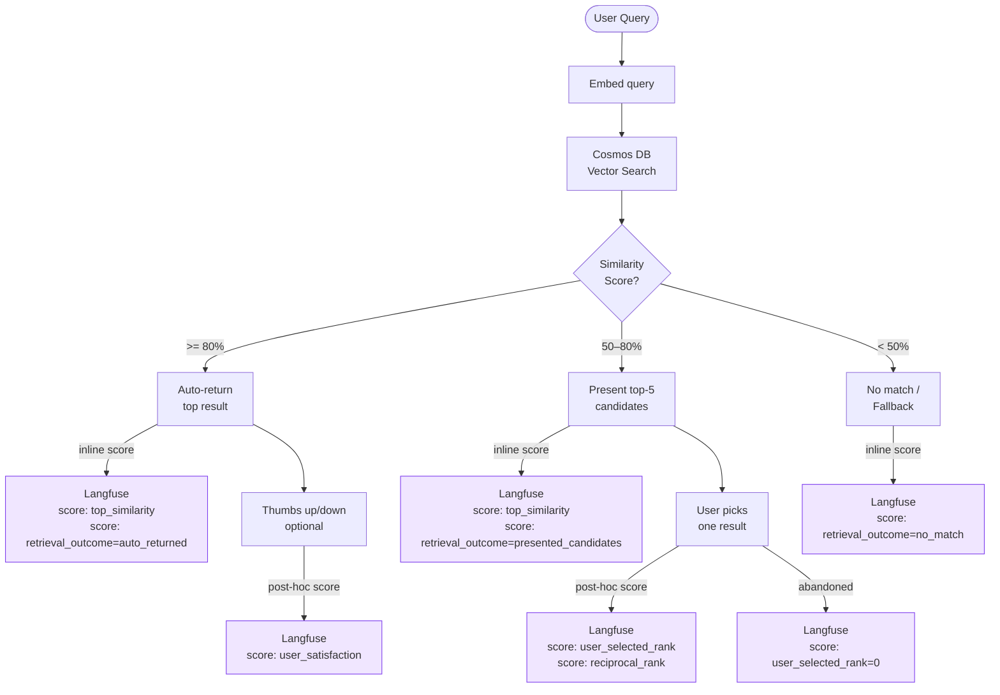
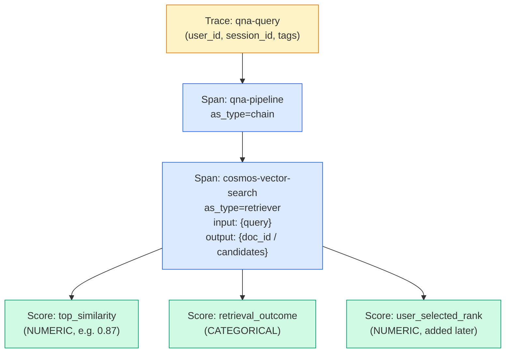
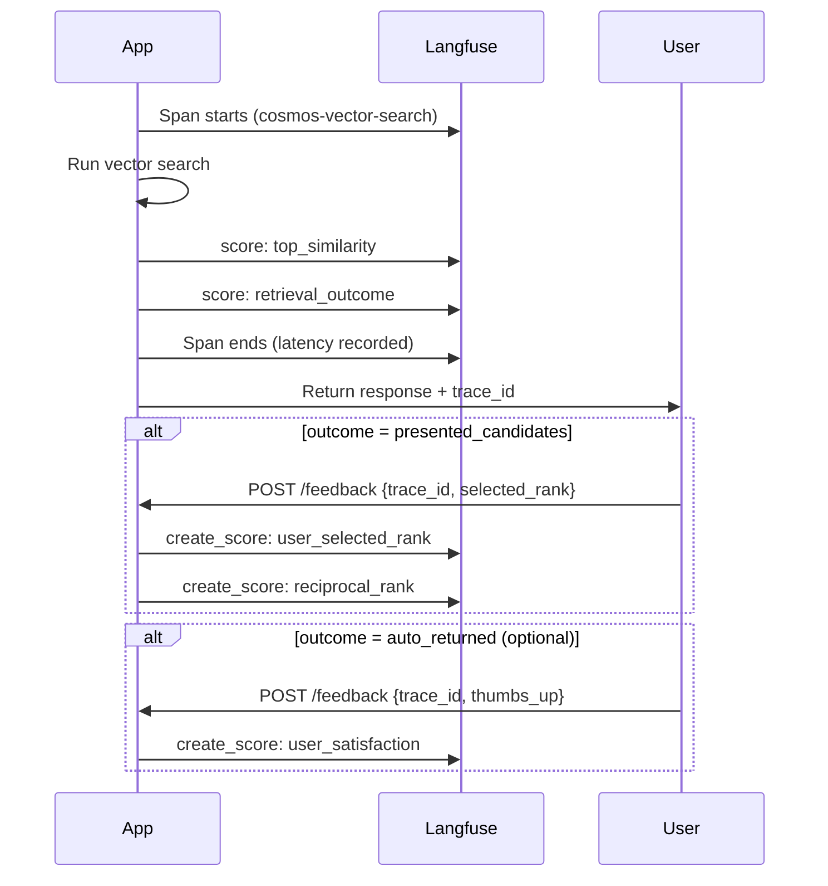
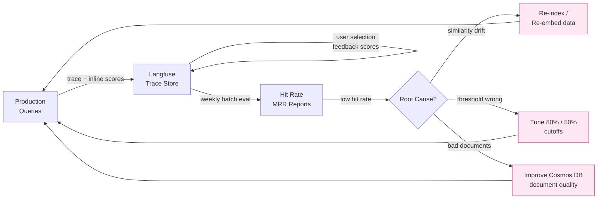
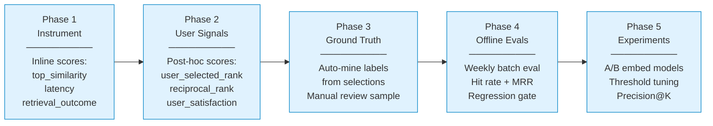

# Langfuse Evals for a Similarity-Search QnA System (No LLM)

## System Description

A retrieval-only QnA system backed by Cosmos DB vector search. No LLM augmentation — responses are static documents retrieved by similarity score.

| Similarity Score | Behaviour |
|-----------------|-----------|
| ≥ 80% | Auto-return the top result |
| 50–80% | Present candidates; user selects one |
| < 50% | No match — fallback/escalation |

### System Flow



---

## Why Evals Still Apply

Langfuse is not LLM-only. It traces any pipeline and scores any observable outcome. In this system the measurable outcomes are:

| Scenario | What to measure |
|----------|-----------------|
| Auto-returned result | Was it actually correct? (needs ground truth or thumbs up/down) |
| User-selection flow | Which rank did they pick? Did they pick at all? |
| No match | Failure/escalation rate over time |

---

## Metrics to Track

### 1. Top Similarity Score (per query)
Record the raw cosine/vector similarity of the top result. Surfaces degradation in the embedding model or data drift over time.

### 2. Retrieval Outcome (categorical)
`auto_returned` | `presented_candidates` | `no_match`  
Lets you see the distribution changing as your data grows.

### 3. User Selected Rank (user-selection flow)
Which position (1–N) the user picked from the candidate list.  
`0` = user abandoned without selecting.

### 4. Reciprocal Rank (MRR contribution)
`1 / selected_rank` — standard IR metric.  
Average over all sessions → **Mean Reciprocal Rank (MRR)**.

### 5. Latency (vector search duration)
The time Cosmos DB takes to return results. A jump in p95 latency may indicate index issues or data growth pressure — unrelated to result quality but critical for ops.

`start_as_current_observation` records start/end time automatically, so latency is captured on every `as_type="retriever"` span without extra code.

### 6. Hit Rate (offline, against a ground-truth test set)
For known Q&A pairs: did the correct document appear in the top-k candidates?  
Run via Langfuse's `run_batched_evaluation` over stored traces.

### 7. Thumbs Up / Down (optional UI addition)
Cheapest ground-truth signal. A single feedback button after auto-return  
→ `user_satisfaction`: `1.0` (thumbs up) or `0.0` (thumbs down).

---

## Langfuse Trace Hierarchy

Every query produces this span tree in the Langfuse UI:



Scores attached to the **trace** (user_satisfaction, reciprocal_rank) vs. scores attached to the **retriever span** (top_similarity, retrieval_outcome) are both visible and filterable in the UI.

---

## Score Collection Timeline

Some scores are written immediately (inline), others only exist after the user interacts:



The key insight: `trace_id` must be returned to the frontend in every response so the second POST can reference the right trace.

---

## Implementation

### 1. Tracing the pipeline

```python
import os
from langfuse import Langfuse, observe, get_client

langfuse = Langfuse(
    public_key=os.environ["LANGFUSE_PUBLIC_KEY"],
    secret_key=os.environ["LANGFUSE_SECRET_KEY"],
    base_url=os.environ["LANGFUSE_BASE_URL"],   # http://localhost:3000 for local
)

@observe(as_type="chain", name="qna-pipeline")
def handle_query(user_query: str, user_id: str, session_id: str) -> dict:
    with langfuse.propagate_attributes(
        user_id=user_id,
        session_id=session_id,
        tags=["no-llm", "retrieval-only"],
        trace_name="qna-query",
    ):
        return _search_and_respond(user_query)


@observe(as_type="retriever", name="cosmos-vector-search")
def _search_and_respond(user_query: str) -> dict:
    results = cosmos_vector_search(user_query)   # list of (doc, score)
    top_score = results[0][1] if results else 0.0

    span = get_client().get_current_observation()
    # trace_id is on the OTel span context — available via the span object
    trace_id = format(span._span.get_span_context().trace_id, '032x')

    # Always record the raw similarity score
    span.score(name="top_similarity", value=top_score, data_type="NUMERIC")

    if top_score >= 0.80:
        span.score(name="retrieval_outcome", value="auto_returned", data_type="CATEGORICAL")
        span.update(output={"doc_id": results[0][0]["id"], "score": top_score})
        return {
            "mode": "auto",
            "answer": results[0][0]["response"],
            "trace_id": trace_id,
        }

    elif top_score >= 0.50:
        candidates = results[:5]
        span.score(name="retrieval_outcome", value="presented_candidates", data_type="CATEGORICAL")
        span.update(
            output={"candidates": [r[0]["id"] for r in candidates]},
            metadata={"candidate_scores": [r[1] for r in candidates]},
        )
        return {
            "mode": "select",
            "candidates": candidates,
            "trace_id": trace_id,
        }

    else:
        span.score(name="retrieval_outcome", value="no_match", data_type="CATEGORICAL")
        return {"mode": "fallback", "trace_id": trace_id}
```

### 2. Recording user selection (after API round-trip)

Call this endpoint/function once the user picks a result from the candidate list:

```python
def on_user_selection(trace_id: str, selected_rank: int, total_candidates: int):
    """selected_rank is 1-based (1 = top result)."""
    langfuse.create_score(
        trace_id=trace_id,
        name="user_selected_rank",
        value=selected_rank,
        data_type="NUMERIC",
        comment=f"Picked rank {selected_rank} of {total_candidates}",
    )
    langfuse.create_score(
        trace_id=trace_id,
        name="reciprocal_rank",
        value=1.0 / selected_rank,
        data_type="NUMERIC",
    )


def on_user_abandoned(trace_id: str):
    """User saw candidates but selected nothing."""
    langfuse.create_score(
        trace_id=trace_id,
        name="user_selected_rank",
        value=0,
        data_type="NUMERIC",
        comment="User abandoned — no result selected",
    )
```

### 3. Post-response thumbs up/down (optional)

```python
def on_user_feedback(trace_id: str, thumbs_up: bool):
    langfuse.create_score(
        trace_id=trace_id,
        name="user_satisfaction",
        value=1.0 if thumbs_up else 0.0,
        data_type="BOOLEAN",
    )
```

### 4. Offline hit-rate batch eval (against ground-truth test set)

Requires a prepared dataset of `(question, correct_doc_id)` pairs.

```python
from langfuse import EvaluatorInputs, Evaluation

def map_trace(*, item) -> EvaluatorInputs:
    return EvaluatorInputs(
        input=item.input,
        output=item.output,                             # {"candidates": [...]} or {"doc_id": ...}
        expected_output=item.metadata.get("correct_doc_id"),
    )


def hit_rate_evaluator(*, input, output, expected_output=None, metadata=None, **kwargs):
    if expected_output is None:
        return Evaluation(name="hit_rate", value=0.0, comment="No ground truth available")

    # Check if correct doc appears in auto-returned or candidate list
    returned_ids = (
        [output["doc_id"]] if "doc_id" in output
        else output.get("candidates", [])
    )
    hit = expected_output in returned_ids
    return Evaluation(
        name="hit_rate",
        value=1.0 if hit else 0.0,
        data_type="BOOLEAN",
        comment="Hit" if hit else "Miss",
    )


result = langfuse.run_batched_evaluation(
    run_name=f"hit-rate-eval-{today}",
    scope="traces",
    filter=[{"name": "tags", "operator": "ARRAY_CONTAINS", "value": "retrieval-only"}],
    mapper=map_trace,
    evaluators=[hit_rate_evaluator],
    dataset_name="qna-ground-truth",
)
```

---

## Additional Considerations

### Embedding Model Version Tagging

If you ever swap the embedding model (or update it), you need to know which traces used which version — otherwise a change in hit rate is ambiguous.

Add the model name as metadata on the retriever span:

```python
span.update(metadata={
    "embedding_model": "text-embedding-3-large",
    "embedding_model_version": "2025-01",
    "index_name": "qna-prod-v2",
})
```

Then filter traces by `metadata.embedding_model` in Langfuse to compare hit rates across model versions.

### Threshold Tuning with Langfuse Data

The 80% / 50% cutoffs are arbitrary starting points. After collecting data you can use Langfuse to find better values:

1. Export traces with scores via the Langfuse UI (CSV/API)
2. Plot `top_similarity` vs. `user_satisfaction` for auto-returned traces — the inflection point where satisfaction drops is your real threshold
3. Plot `top_similarity` vs. `user_selected_rank` for presented-candidates traces — if users never pick results below 60%, raise the lower cutoff

### Score Configs in the Langfuse UI

Before writing scores in code, create **Score Configs** in Langfuse (Settings → Scores):

| Config name | Type | Range / Options |
|-------------|------|-----------------|
| `top_similarity` | NUMERIC | 0.0 – 1.0 |
| `retrieval_outcome` | CATEGORICAL | `auto_returned`, `presented_candidates`, `no_match` |
| `user_selected_rank` | NUMERIC | 0 – 10 |
| `reciprocal_rank` | NUMERIC | 0.0 – 1.0 |
| `user_satisfaction` | BOOLEAN | — |
| `hit_rate` | BOOLEAN | — |

Once configs exist, Langfuse validates incoming scores against them and enables richer UI filtering, grouping, and chart axes. Pass the `config_id` UUID from the UI into `create_score` / `span.score` calls to link them.

---

## Advanced Patterns

### Precision@K Evaluator

Hit rate checks presence (did the correct doc appear anywhere in top-K?). Precision@K measures density (how many of the top-K results are relevant?). Useful when users scan a candidate list — a list with the right document at rank 5 has very different UX from rank 1.

```python
def precision_at_k_evaluator(*, input, output, expected_output=None, metadata=None, **kwargs):
    """Only meaningful for presented_candidates mode — skip auto-returned traces."""
    if expected_output is None or "candidates" not in output:
        return None  # Returning None causes Langfuse to skip this trace

    k = len(output["candidates"])
    relevant = sum(1 for doc_id in output["candidates"] if doc_id == expected_output)
    precision = relevant / k if k > 0 else 0.0

    return Evaluation(
        name=f"precision_at_{k}",
        value=precision,
        data_type="NUMERIC",
        comment=f"{relevant} relevant result(s) in top {k}",
    )
```

For a 5-candidate list with exactly one correct answer, P@5 = 0.2 when present, 0.0 when absent. Always use alongside hit_rate, not instead of it.

### Mining Ground Truth from Production Traffic

Manually curating ground-truth Q&A pairs is expensive. User selections in the `presented_candidates` flow are implicit labels — each one is a `(query, correct_doc_id)` pair generated for free.

```python
def on_user_selection(
    trace_id: str,
    selected_rank: int,
    total_candidates: int,
    query: str,
    selected_doc_id: str,
):
    langfuse.create_score(
        trace_id=trace_id,
        name="user_selected_rank",
        value=selected_rank,
        data_type="NUMERIC",
        comment=f"Picked rank {selected_rank} of {total_candidates}",
    )
    langfuse.create_score(
        trace_id=trace_id,
        name="reciprocal_rank",
        value=1.0 / selected_rank,
        data_type="NUMERIC",
    )

    # Weak supervision: rank 1 or 2 selections are high-confidence implicit labels
    if selected_rank <= 2:
        langfuse.create_dataset_item(
            dataset_name="qna-ground-truth",
            input={"query": query},
            expected_output={"correct_doc_id": selected_doc_id},
            metadata={
                "source": "implicit_label",
                "selected_rank": selected_rank,
                "trace_id": trace_id,
            },
        )
```

With enough traffic, this dataset grows without any manual effort. The weekly batch eval then runs against an ever-improving test set. Periodically audit a sample to discard noise (rank-2 selections where the user then immediately re-queried may not be true positives).

### Document-Level Analytics

Emitting `doc_id` and `doc_category` into span metadata makes documents first-class citizens in Langfuse, enabling document-scoped analysis:

```python
span.update(
    output={"doc_id": results[0][0]["id"], "score": top_score},
    metadata={
        "doc_id": results[0][0]["id"],
        "doc_title": results[0][0].get("title", ""),
        "doc_category": results[0][0].get("category", ""),
    },
)
```

Filter by `metadata.doc_id` in Langfuse to answer questions like:

| Pattern | Diagnosis |
|---------|----------|
| Doc appears frequently, always high satisfaction | Reliable anchor document |
| Doc appears frequently, high abandonment rate | Title matches query but content disappoints |
| Doc appears with high similarity but low rank selection | Index is biased toward it — may need score normalisation |
| Doc never appears in any trace | Possibly not indexed, wrong category, or embedding outlier |

### No-Match Query Mining

Every `retrieval_outcome = no_match` trace is an unanswered question — and a prioritised list of documents you need to add to Cosmos DB. Make them searchable by persisting the raw query in span metadata:

```python
else:
    span.score(name="retrieval_outcome", value="no_match", data_type="CATEGORICAL")
    span.update(
        metadata={
            "failed_query": user_query,
            "top_score_reached": top_score,  # Useful: 0.49 is close, 0.12 is far
        },
    )
    return {"mode": "fallback", "trace_id": trace_id}
```

Weekly workflow:

1. In Langfuse, filter traces where `retrieval_outcome = no_match`
2. Export the `metadata.failed_query` values
3. Cluster or manually group them by topic
4. Each cluster = a missing document or a missing synonym in your Cosmos DB
5. Sort by `top_score_reached` descending — queries at 0.45–0.49 are near-misses that may only need a rephrase in an existing document

### A/B Testing Embedding Models

Swapping embedding models is high-risk: a model that scores better on benchmarks may underperform on your specific domain vocabulary. Use Langfuse tags to run a controlled shadow comparison before committing:

```python
@observe(as_type="chain", name="qna-pipeline")
def handle_query(user_query: str, user_id: str, session_id: str) -> dict:
    # Shadow n% of traffic through the candidate model
    import random
    embed_model = "embed-v2" if random.random() < 0.10 else "embed-v1"

    with langfuse.propagate_attributes(
        user_id=user_id,
        session_id=session_id,
        tags=["no-llm", "retrieval-only", embed_model],
        trace_name="qna-query",
    ):
        return _search_and_respond(user_query, embed_model=embed_model)
```

After a week of traffic split, compare in Langfuse:

| Metric | Filter: `embed-v1` | Filter: `embed-v2` | Verdict |
|--------|-------------------|-------------------|---------|
| `top_similarity` avg | 0.79 | 0.82 | v2 better |
| `hit_rate` | 72% | 78% | v2 better |
| `user_satisfaction` | 0.81 | 0.77 | v2 worse — unexpected |
| `no_match` rate | 18% | 14% | v2 better |

The satisfaction regression in the example above would catch a real problem that benchmarks missed. Only migrate fully after all key metrics move in the same direction.

---

## What You Get in the Langfuse UI

| View | Insight |
|------|---------|
| Score distribution: `top_similarity` | Are queries cluster high or low? Is quality drifting? |
| Score distribution: `retrieval_outcome` | Auto vs select vs no-match breakdown |
| Score trend: `reciprocal_rank` | Is MRR improving after data/embedding updates? |
| Score trend: `user_selected_rank` | Are users picking rank 1 most often (good) or rank 4–5 (retrieval is off)? |
| `user_selected_rank = 0` rate | Abandonment funnel |
| `user_satisfaction` trend | Do auto-returned results satisfy users over time? |
| Session view | Full query history per user |
| Batch eval runs | Hit-rate regression testing against known Q&A pairs |

---

## Eval Feedback Loop

How the data flows from production back into system improvements:



---

## Rollout Maturity Model

You don't need to implement everything at once. Build up in phases:



| Phase | Effort | Value |
|-------|--------|-------|
| 1 — Instrument | Low — add `@observe` to existing functions | Immediate visibility into similarity scores and outcome distribution |
| 2 — User signals | Medium — requires frontend changes (feedback endpoint) | MRR, abandonment funnel, satisfaction trends |
| 3 — Ground truth | Low marginal effort — built from Phase 2 data | Free labelled test set grows with traffic |
| 4 — Offline evals | Medium — schedule a job, wire dataset | Regression detection; catch silent quality drops |
| 5 — Experiments | High-confidence decisions — not guesswork | Data-driven embedding model upgrades, calibrated thresholds |

A team with one hour can complete Phase 1. Phase 5 is only worth doing once Phases 1–4 have generated enough historical data to make comparisons meaningful (~500+ traces).

---

## No LLM Required

All scores above are:
- Derived from the similarity score itself (objective)
- Derived from user behaviour (implicit labels)
- Derived from ground-truth doc IDs (offline eval)

None of them require an LLM judge. Langfuse's scoring API accepts any float/string/bool — the source is entirely up to you.

---

## Next Steps

Follow the [Rollout Maturity Model](#rollout-maturity-model) phases in order. Concrete first actions:

**Phase 1 (start here):**
1. **Create Score Configs in Langfuse UI first** — Settings → Scores, before writing any traces
2. **Add `@observe` decorators** to the existing query handler and Cosmos DB search call
3. **Tag traces with embedding model version** — `metadata.embedding_model` + `metadata.index_name` on the retriever span
4. **Return `trace_id` in every API response** — required for all Phase 2+ feedback

**Phase 2:**
5. **Add `/feedback` endpoint** — handle user selection, abandonment, and thumbs up/down; call `create_score` for each
6. **Enable no-match query logging** — persist `metadata.failed_query` + `top_score_reached` on fallback traces; export weekly to find content gaps

**Phase 3:**
7. **Enable implicit label mining** — update `on_user_selection` to call `create_dataset_item` for rank ≤ 2 selections
8. **Emit `doc_id` / `doc_category` to span metadata** — unlocks document-level analytics in Langfuse

**Phase 4:**
9. **Run first baseline batch eval** — use the auto-mined ground-truth dataset; establishes an MRR and hit-rate baseline
10. **Set up a weekly scheduled job** — `run_batched_evaluation` with the `retrieval-only` tag filter; alert if hit-rate drops > 5 pp

**Phase 5 (after ~500 traces):**
11. **Analyse threshold calibration** — export `top_similarity` vs. `user_satisfaction`; find the real inflection point for the 80%/50% cuts
12. **Run A/B embed model test** — shadow 10% of traffic through a candidate model using the tag-based split pattern; only migrate after all key metrics improve
