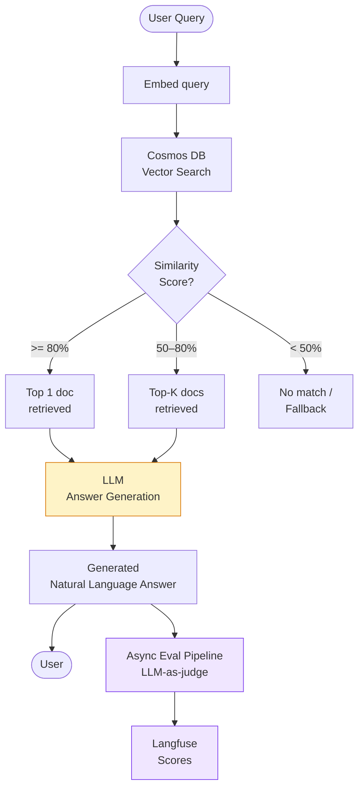
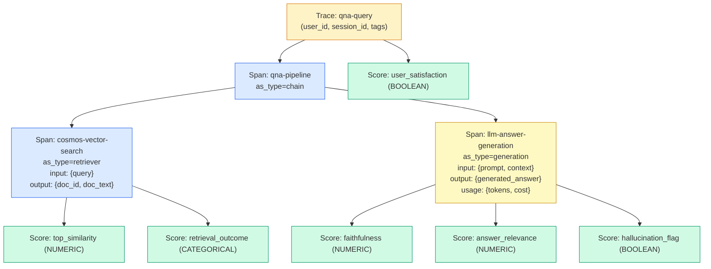
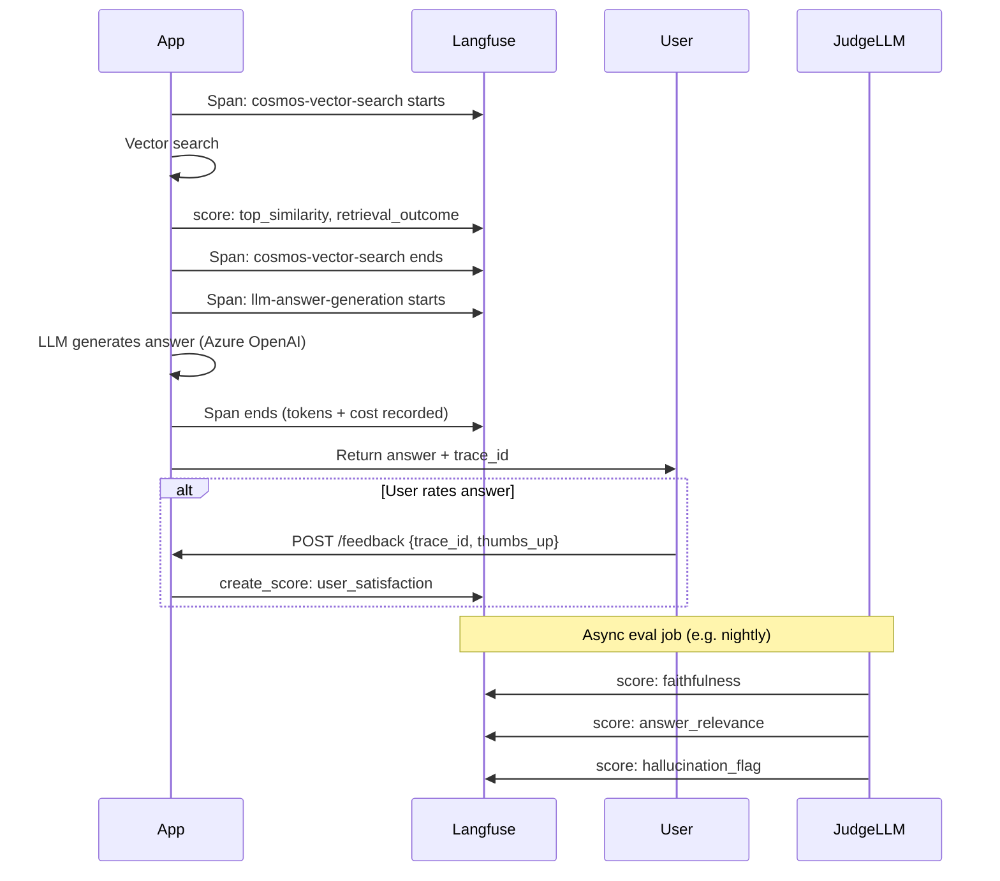
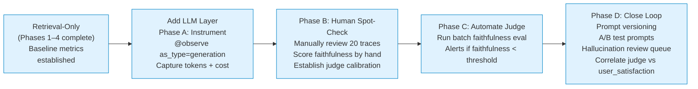

# Langfuse Evals for a Similarity-Search QnA System (With LLM Augmentation)

> **Companion to** `langfuse_sim_search_qna_idea.md`  
> That document covers the retrieval-only phase. This document covers what changes — and what stays the same — when an LLM is added to generate answers from retrieved documents (RAG pattern).

---

## How the System Changes

The retrieval pipeline gains one new step: after Cosmos DB returns the top result(s), an LLM generates a natural-language answer _grounded in the retrieved document_.

```
Before:  Query → Embed → Cosmos DB → Top Doc → Return as-is
After:   Query → Embed → Cosmos DB → Top Doc(s) → LLM → Generated Answer
```

Now you have a **real input/output pair to evaluate**:
- **Input to LLM**: the user's question + the retrieved document(s) as context
- **Output from LLM**: a generated answer in natural language

This is the point where LLM-as-judge becomes both necessary and highly effective.

---

## Evolved System Architecture



---

## New Trace Hierarchy

Adding an LLM call inserts a `generation` span inside the chain, alongside the existing `retriever` span:



**Key distinction**: retrieval scores attach to the `retriever` span; answer quality scores attach to the `generation` span. Both roll up to the same trace and are visible together in the Langfuse UI.

---

## What Stays the Same (Retrieval Metrics Still Apply)

All metrics from `langfuse_sim_search_qna_idea.md` continue working unchanged:

| Metric | Still relevant? | Notes |
|--------|----------------|-------|
| `top_similarity` | ✅ Yes | Bad retrieval → bad answer; this surface stays important |
| `retrieval_outcome` | ✅ Yes | Distribution still tells you how often retrieval succeeds |
| `user_selected_rank` / `reciprocal_rank` | ✅ Yes | If you keep a candidate selection step |
| `latency` | ✅ Yes | Now latency = retrieval_latency + llm_latency — trace both |
| `hit_rate` (offline) | ✅ Yes | Ground-truth retrieval check is still valid |
| `user_satisfaction` | ✅ Yes | Now more meaningful — user rates the full answer, not just retrieved doc |

The LLM layer adds **new scores on top**. It does not replace retrial metrics.

---

## New Metrics (LLM Output Quality)

### 1. Faithfulness (Groundedness)
Did the LLM answer stick to the retrieved document, or did it invent facts?  
Score: 0.0–1.0. A score < 0.5 means the answer contradicts or goes beyond the source.

### 2. Answer Relevance
Does the generated answer actually address what the user asked?  
The retrieved doc may be correct but the LLM may answer a related but different question.  
Score: 0.0–1.0.

### 3. Hallucination Flag
Binary: did the LLM introduce any specific claim not present in the context?  
Useful as a hard gate — flag traces where `hallucination_flag = True` for human review.

### 4. Context Relevance (Cross-layer)
Was the retrieved document actually relevant to the question, independent of whether the LLM used it well?  
This bridges retrieval and generation — a low score here means the retrieval step failed, not the LLM.  
Score: 0.0–1.0.

### 5. Response Completeness
Did the LLM answer all aspects of the question?  
Useful when users ask multi-part questions.

### 6. Token Cost (per trace)
Langfuse captures token usage automatically on `as_type="generation"` spans.  
Track cost per query to detect prompt bloat or context window overuse.

---

## Updated Score Configs

Add these to the existing Score Configs in Langfuse (Settings → Scores):

| Config name | Type | Range / Options | Who writes it |
|-------------|------|-----------------|---------------|
| `faithfulness` | NUMERIC | 0.0 – 1.0 | LLM judge (async) |
| `answer_relevance` | NUMERIC | 0.0 – 1.0 | LLM judge (async) |
| `context_relevance` | NUMERIC | 0.0 – 1.0 | LLM judge (async) |
| `hallucination_flag` | BOOLEAN | — | LLM judge (async) |
| `response_completeness` | NUMERIC | 0.0 – 1.0 | LLM judge (async) |
| `user_satisfaction` | BOOLEAN | — | User (post-hoc) |

---

## Implementation

### 1. Extended Tracing Pipeline

```python
import os
from openai import AzureOpenAI
from langfuse import Langfuse, observe, get_client

langfuse = Langfuse(
    public_key=os.environ["LANGFUSE_PUBLIC_KEY"],
    secret_key=os.environ["LANGFUSE_SECRET_KEY"],
    base_url=os.environ["LANGFUSE_BASE_URL"],
)

openai_client = AzureOpenAI(
    azure_endpoint=os.environ["AZURE_OPENAI_ENDPOINT"],
    api_key=os.environ["AZURE_OPENAI_API_KEY"],
    api_version="2024-11-01-preview",
)


@observe(as_type="chain", name="qna-pipeline")
def handle_query(user_query: str, user_id: str, session_id: str) -> dict:
    with langfuse.propagate_attributes(
        user_id=user_id,
        session_id=session_id,
        tags=["llm-augmented", "rag"],
        trace_name="qna-query",
    ):
        doc, retrieval_meta = _retrieve(user_query)
        if doc is None:
            return {"mode": "fallback", "trace_id": retrieval_meta["trace_id"]}
        answer_meta = _generate_answer(user_query, doc)
        return {
            "mode": "generated",
            "answer": answer_meta["answer"],
            "trace_id": retrieval_meta["trace_id"],
        }


@observe(as_type="retriever", name="cosmos-vector-search")
def _retrieve(user_query: str) -> tuple[dict | None, dict]:
    results = cosmos_vector_search(user_query)
    top_score = results[0][1] if results else 0.0

    span = get_client().get_current_observation()
    trace_id = format(span._span.get_span_context().trace_id, '032x')

    span.score(name="top_similarity", value=top_score, data_type="NUMERIC")
    span.update(metadata={
        "embedding_model": os.environ.get("EMBED_MODEL", "text-embedding-3-large"),
    })

    if top_score >= 0.50:
        doc = results[0][0]
        span.score(name="retrieval_outcome", value="retrieved", data_type="CATEGORICAL")
        span.update(output={"doc_id": doc["id"], "doc_text": doc["content"][:200]})
        return doc, {"trace_id": trace_id}
    else:
        span.score(name="retrieval_outcome", value="no_match", data_type="CATEGORICAL")
        span.update(metadata={"failed_query": user_query, "top_score_reached": top_score})
        return None, {"trace_id": trace_id}


@observe(as_type="generation", name="llm-answer-generation")
def _generate_answer(user_query: str, doc: dict) -> dict:
    system_prompt = (
        "You are a QnA assistant. Answer the user's question using ONLY the provided context. "
        "If the context does not contain enough information, say so explicitly. "
        "Do not invent facts."
    )
    context = doc["content"]

    # Langfuse captures input/output/token usage automatically on as_type="generation"
    span = get_client().get_current_observation()
    span.update(
        input={"query": user_query, "context_doc_id": doc["id"]},
        model=os.environ.get("AZURE_OPENAI_DEPLOYMENT", "gpt-4o"),
        metadata={"context_length_chars": len(context)},
    )

    response = openai_client.chat.completions.create(
        model=os.environ["AZURE_OPENAI_DEPLOYMENT"],
        messages=[
            {"role": "system", "content": system_prompt},
            {"role": "user", "content": f"Context:\n{context}\n\nQuestion: {user_query}"},
        ],
        max_tokens=512,
        temperature=0.0,  # Deterministic for factual QnA
    )

    answer = response.choices[0].message.content
    span.update(output={"answer": answer})

    return {"answer": answer, "context": context, "query": user_query}
```

### 2. LLM-as-Judge Evaluators (Async Batch)

These run offline against stored traces — they do NOT run in the hot path. Cost is paid once per eval job, not per user request.

```python
from langfuse import EvaluatorInputs, Evaluation


FAITHFULNESS_PROMPT = """\
You are an evaluation assistant.

Given a QUESTION, a CONTEXT document, and an ANSWER:
- Rate FAITHFULNESS: how well does the answer stay within the facts in the context?
- Score 1.0 = completely grounded, 0.0 = completely fabricated.

Respond with a single JSON object:
{{"score": <float 0.0-1.0>, "reason": "<one sentence>"}}

QUESTION: {question}
CONTEXT: {context}
ANSWER: {answer}
"""

ANSWER_RELEVANCE_PROMPT = """\
You are an evaluation assistant.

Given a QUESTION and an ANSWER, rate how directly and completely the answer addresses the question.
Score 1.0 = perfectly relevant, 0.0 = completely off-topic.

Respond with a single JSON object:
{{"score": <float 0.0-1.0>, "reason": "<one sentence>"}}

QUESTION: {question}
ANSWER: {answer}
"""


def _call_judge(prompt: str) -> tuple[float, str]:
    """Call the judge LLM and parse the JSON score."""
    import json
    response = openai_client.chat.completions.create(
        model=os.environ["JUDGE_MODEL"],   # e.g. "gpt-4o" — use a capable model
        messages=[{"role": "user", "content": prompt}],
        temperature=0.0,
        response_format={"type": "json_object"},
    )
    data = json.loads(response.choices[0].message.content)
    return float(data["score"]), data.get("reason", "")


def faithfulness_evaluator(*, input, output, metadata=None, **kwargs):
    question = input.get("query", "")
    context = input.get("context", "") or (metadata or {}).get("context", "")
    answer = output.get("answer", "")

    if not context or not answer:
        return None  # Skip — not enough data

    score, reason = _call_judge(
        FAITHFULNESS_PROMPT.format(question=question, context=context, answer=answer)
    )
    return Evaluation(
        name="faithfulness",
        value=score,
        data_type="NUMERIC",
        comment=reason,
    )


def answer_relevance_evaluator(*, input, output, metadata=None, **kwargs):
    question = input.get("query", "")
    answer = output.get("answer", "")

    if not answer:
        return None

    score, reason = _call_judge(
        ANSWER_RELEVANCE_PROMPT.format(question=question, answer=answer)
    )
    return Evaluation(
        name="answer_relevance",
        value=score,
        data_type="NUMERIC",
        comment=reason,
    )


def hallucination_flag_evaluator(*, input, output, metadata=None, **kwargs):
    """Faithfulness below threshold → flag as potential hallucination."""
    # Run faithfulness first, flag if below 0.6
    result = faithfulness_evaluator(input=input, output=output, metadata=metadata)
    if result is None:
        return None
    flagged = result.value < 0.60
    return Evaluation(
        name="hallucination_flag",
        value=1.0 if flagged else 0.0,
        data_type="BOOLEAN",
        comment=f"Faithfulness={result.value:.2f}. {'Flagged for review.' if flagged else 'OK.'}",
    )
```

### 3. Running the Batch Eval Job

```python
from datetime import date

today = date.today().isoformat()

result = langfuse.run_batched_evaluation(
    run_name=f"rag-quality-eval-{today}",
    scope="traces",
    filter=[
        {"name": "tags", "operator": "ARRAY_CONTAINS", "value": "rag"},
        # Optionally limit to recent traces:
        # {"name": "timestamp", "operator": "GT", "value": "2026-04-01T00:00:00Z"},
    ],
    evaluators=[
        faithfulness_evaluator,
        answer_relevance_evaluator,
        hallucination_flag_evaluator,
    ],
)
print(f"Evaluated {result.total_traces} traces")
print(f"Avg faithfulness: {result.scores['faithfulness'].mean:.3f}")
print(f"Avg answer_relevance: {result.scores['answer_relevance'].mean:.3f}")
print(f"Hallucination rate: {result.scores['hallucination_flag'].mean * 100:.1f}%")
```

### 4. Human Review Queue for Flagged Traces

Hallucination-flagged traces need a human reviewer. Langfuse's annotation queue feature handles this:

```python
# After the batch eval, push flagged traces to a review queue
for trace in result.trace_results:
    flag_score = trace.scores.get("hallucination_flag")
    if flag_score and flag_score.value == 1.0:
        langfuse.create_annotation_queue_item(
            queue_name="hallucination-review",
            trace_id=trace.trace_id,
            comment=flag_score.comment,
        )
```

Reviewers then work through the queue in the Langfuse UI, adding a human-verified `hallucination_confirmed` score (BOOLEAN). This creates a gold dataset for calibrating whether your judge is reliable.

---

## Score Collection Timeline (Updated)



---

## LLM Judge Reliability

LLM-as-judge is powerful but not infallible. A few guards to put in place:

### Calibrate your judge
Run the judge against ~50 manually annotated examples. If judge faithfulness scores agree with human scores > 80% of the time, the judge is usable. Track this in a `judge_calibration` dataset.

### Use a stronger model for judging
Your production LLM can be a cheaper/faster model. The judge should be your best available model (e.g. `gpt-4o` if production uses `gpt-4o-mini`). Accuracy matters more than cost for the eval job.

### Keep judge prompts versioned
Store your judge prompts in Langfuse prompt management so changes are auditable:

```python
faithfulness_prompt_obj = langfuse.get_prompt("faithfulness-judge", version=3)
faithfulness_prompt = faithfulness_prompt_obj.compile(
    question=question,
    context=context,
    answer=answer,
)
```

### Watch for judge self-agreement bias
If the same model is both the answer producer and the judge, it may be biased toward rating its own outputs highly. Use a different model family as judge when possible.

---

## Prompt Management

When you add an LLM, the system prompt becomes a critical artifact. Langfuse stores and versions prompts:

```python
# On startup — fetch production prompt
system_prompt_obj = langfuse.get_prompt("qna-system-prompt", label="production")
system_prompt = system_prompt_obj.compile()   # returns the prompt string

# When calling OpenAI, link the generation span to the prompt version
span.update(
    metadata={
        "prompt_name": "qna-system-prompt",
        "prompt_version": system_prompt_obj.version,
    }
)
```

Why this matters: if you change the system prompt and faithfulness drops, you need to know which version caused the regression. Langfuse lets you filter traces by `metadata.prompt_version` and compare score distributions before and after.

---

## Cost Tracking

Each `as_type="generation"` span in Langfuse automatically captures:
- `input_tokens` / `output_tokens`
- Model name
- Cost (if you configure model prices in Langfuse Settings → Models)

This means you can filter by `trace.tags = "rag"` and see total LLM spend per day, or compare per-query token cost across prompt versions.

The judge LLM adds a second generation cost. Track it separately by naming the judge span distinctly (`llm-judge-faithfulness`) so you can see the eval overhead vs. production cost.

---

## What You Get in the Langfuse UI (Updated)

| View | Insight |
|------|---------|
| Score: `top_similarity` | Retrieval quality — unchanged from no-LLM setup |
| Score: `faithfulness` trend | Is the LLM staying grounded over time? |
| Score: `answer_relevance` trend | Are answers addressing what users ask? |
| `hallucination_flag = True` rate | % of traces needing human review |
| Annotation queue: `hallucination-review` | Human review workload |
| Token cost per trace | Budget tracking; detect prompt bloat |
| Traces filtered by `prompt_version` | Prompt A/B comparison |
| `user_satisfaction` vs `faithfulness` correlation | Validate that judge scores predict user sentiment |

---

## Continuity with the No-LLM Phase

The data you collect in the retrieval-only phase has direct value when LLM augmentation is added:

| What you have from Phase 1–4 | How it helps in the LLM phase |
|------------------------------|-------------------------------|
| Ground-truth Q&A dataset (auto-mined from user selections) | Becomes the eval dataset for RAG quality — same `correct_doc_id`, now also check answer quality |
| Baseline hit-rate and MRR | Provides a pre-LLM retrieval baseline to ensure the LLM layer doesn't _hurt_ retrieval signal |
| `top_similarity` distribution | Informs context selection strategy — should you pass 1 doc or top-3? |
| No-match query log | First backlog for prompt engineering — these queries need special handling or fallback prompt |
| Embedding model version tags | Still needed — if you retrain embeddings, the retrieval baseline must be re-established first |

You don't start from zero. Every trace collected without an LLM is a pre-eval data point.

---

## Rollout Path (LLM Addition)



**Do not skip Phase B.** Running an automated judge without first calibrating it against human scores is the main failure mode of LLM-as-judge setups. Budget 2–3 hours to label 20 traces by hand — it pays back immediately in confidence that the judge is trustworthy.

---

## No Reality Check Needed

Your instinct is exactly right. The core idea:

> "Whatever we give as input and whatever we get as output — can we evaluate it?"

Yes. That's the entire premise of LLM-as-judge. In Langfuse terms:
- **Input** = the `input` field of the `generation` span (your prompt + context)
- **Output** = the `output` field of the `generation` span (the LLM's answer)
- **Evaluation** = another LLM reads both and scores them on faithfulness, relevance, hallucination

The tracing infrastructure you build for retrieval-only mode is the same infrastructure. The only additions are:
1. A `generation` span around the LLM call
2. Async batch evaluators that call a judge LLM
3. Prompts stored and versioned in Langfuse

Everything else — scores, datasets, batch eval, annotation queues — works identically.

---

## Next Steps (LLM Phase)

1. **Complete Phases 1–4 of the retrieval-only rollout first** — baseline data is essential before adding LLM complexity
2. **Instrument the LLM call** with `@observe(as_type="generation")` — tokens and latency captured automatically
3. **Manually label 20 traces** for faithfulness before trusting the automated judge
4. **Configure model pricing** in Langfuse (Settings → Models) to enable cost tracking per trace
5. **Store system prompt in Langfuse prompt management** — enables version-controlled A/B testing
6. **Set up nightly judge eval job** — faithfulness + answer_relevance + hallucination_flag
7. **Create annotation queue** for hallucination-flagged traces — gives human reviewers a clear workload
8. **Correlate `faithfulness` vs `user_satisfaction`** after 200+ traces — validates that your judge predicts what users actually think

---

## To Revisit

Parking these for later implementation — come back when the core LLM phase instrumentation is stable.

- **Wire `@observe` onto live Cosmos DB search functions** — Phase 1 in real code: add the decorators to the actual search service, not just prototypes. Confirm trace IDs propagate end-to-end before layering on eval.
- **Write the context relevance judge prompt** — `context_relevance` is listed as a metric (§ New Metrics) but the judge evaluator code wasn't written out. Needs a prompt that scores whether the retrieved chunks were actually relevant to the question, independent of what the LLM said.
- **Set up Langfuse dashboard alerts** — once traces are flowing, configure alerts for:
  - `faithfulness` score drops below threshold (e.g. weekly avg < 0.7)
  - `hallucination_flag` rate spikes above a threshold (e.g. > 10% of traces in a day)
  - Latency p95 regressions after prompt or embedding model changes
