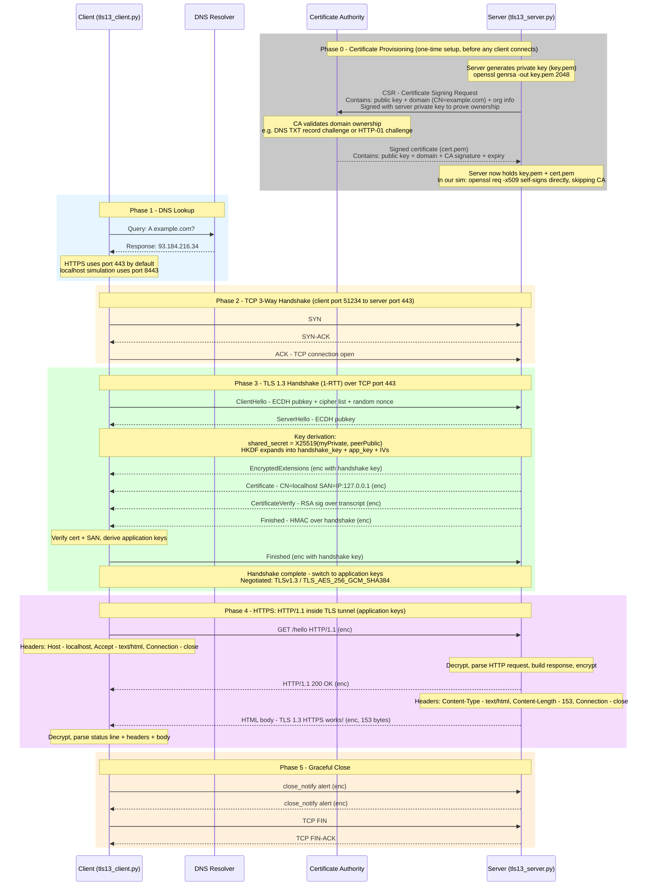

# TLS 1.3 — Research Brief + Python Localhost Simulation

> **Goal**: Understand TLS 1.3 by simulating a real connection on localhost using Python.

---

## 1. What Is TLS 1.3?

**TLS** (Transport Layer Security) is the protocol that encrypts every HTTPS connection you make. Version 1.3 was published in **RFC 8446** (August 2018) and is now the standard.

Think of it as a two-phase process every time your browser talks to a server:
1. **Handshake phase** — agree on keys and verify identity (encrypted metadata)
2. **Application phase** — send/receive actual data (fully encrypted)

TLS 1.3 made the handshake significantly faster and more secure by removing 20+ years of accumulated legacy baggage.

---

## 2. The TLS 1.3 Handshake (1-RTT)

The "1-RTT" means only **one round-trip** is needed before encrypted data can flow. Here's what happens in order:

```
Client                              Server
  |                                    |
  |--- 1. ClientHello ---------------->|   (public key + client random + cipher list)
  |                                    |
  |<-- 2. ServerHello -----------------|   (server's public key)
  |<-- 3. EncryptedExtensions ---------|   (server certificate, etc.) ← now encrypted!
  |<-- 4. CertificateVerify ----------|
  |<-- 5. Finished --------------------|
  |                                    |
  |--- 6. Finished ------------------->|   (client confirms)
  |                                    |
  |<========= Application Data =======>|   (fully encrypted from here)
```

### Step-by-step breakdown

| Step | Who | What happens |
|------|-----|--------------|
| 1 | Client | Sends **ClientHello**: a freshly generated ephemeral public key (ECDH/X25519), 32 random bytes, list of supported cipher suites |
| 2 | Server | Sends **ServerHello**: its own ephemeral public key |
| 3–5 | Server | **Both sides now independently derive the same shared secret** using ECDH and then run it through HKDF (key derivation). The server's certificate is sent *encrypted* using these new keys |
| 6 | Client | Sends **Finished**, uses the application keys from this point on |

### Why is this faster than TLS 1.2?

- **TLS 1.2** needed 2 round-trips before any data could flow
- **TLS 1.3** only needs 1 round-trip (1-RTT)
- **TLS 1.3 0-RTT** (session resumption) can even send data with the first message, though with some replay-attack caveats

### Full TLS 1.3 + HTTPS Request Flow



---

## 3. The Cryptography Inside TLS 1.3

### Key Exchange — ECDH (Elliptic Curve Diffie-Hellman)

```
Client:
  privateKey  = random_32_bytes()          # "scalar"
  publicKey   = X25519(privateKey, G)      # G = curve basepoint

Server does the same → serverPrivateKey, serverPublicKey

After exchanging public keys:
  sharedSecret = X25519(clientPrivate, serverPublic)
               = X25519(serverPrivate, clientPublic)   ← same result!
```

Neither side ever sent the private key. An attacker who observed the exchange cannot compute the shared secret. This is **forward secrecy** — each session uses a fresh throwaway key pair.

### Key Derivation — HKDF

From the 32-byte shared secret, TLS 1.3 derives **at least 4 symmetric keys** using HKDF (HMAC-based Key Derivation Function):

| Key | Used for |
|-----|----------|
| `client_handshake_key` + `iv` | Client → Server during handshake |
| `server_handshake_key` + `iv` | Server → Client during handshake |
| `client_application_key` + `iv` | Client → Server application data |
| `server_application_key` + `iv` | Server → Client application data |

### Encryption — AES-256-GCM or ChaCha20-Poly1305

TLS 1.3 only allows **AEAD** (Authenticated Encryption with Associated Data) ciphers. AEAD both encrypts *and* authenticates the message — an attacker cannot tamper with a ciphertext without being detected.

TLS data is sent in **records** (blocks), not as a stream. Each record uses a fresh IV derived by XOR-ing the base IV with the record counter.

---

## 4. What TLS 1.3 Removed vs TLS 1.2

| Feature | TLS 1.2 | TLS 1.3 |
|---------|---------|---------|
| Round trips | 2 | 1 (or 0 for resumption) |
| RSA key exchange | ✅ | ❌ removed |
| Static DH | ✅ | ❌ removed |
| RC4, 3DES, MD5 | ✅ (legacy) | ❌ removed |
| SHA-1 | ✅ | ❌ removed |
| Renegotiation | ✅ | ❌ removed |
| Forward secrecy | Optional | Mandatory |
| Allowed cipher suites | ~30 | 5 (all AEAD) |
| Certificate in clear text | Yes | No — encrypted |

TLS 1.3's allowed cipher suites:
- `TLS_AES_128_GCM_SHA256`
- `TLS_AES_256_GCM_SHA384`
- `TLS_CHACHA20_POLY1305_SHA256`
- `TLS_AES_128_CCM_SHA256`
- `TLS_AES_128_CCM_8_SHA256`

---

## 5. Python Localhost Simulation

### Prerequisites

```bash
# Python stdlib ssl module uses OpenSSL underneath
# Verify TLS 1.3 is available
python3 -c "import ssl; print(ssl.HAS_TLSv1_3)"   # Must print True
python3 -c "import ssl; print(ssl.OPENSSL_VERSION)" # Must be >= 1.1.1
```

### Step 1 — Generate a self-signed certificate

```bash
# Creates cert.pem (certificate) and key.pem (private key)
openssl req -x509 -newkey rsa:2048 -keyout key.pem -out cert.pem \
    -days 365 -nodes \
    -subj "/CN=localhost" \
    -addext "subjectAltName=IP:127.0.0.1,DNS:localhost"
```

> The `-addext subjectAltName` line is required on modern OpenSSL to avoid hostname verification errors.

### Step 2 — Server ([tls13_server.py](tls13_server.py))

```python
import ssl
import socket
import threading

HOST = "127.0.0.1"
PORT = 8443


def run_server():
    # Create a TLS 1.3-only server context
    ctx = ssl.SSLContext(ssl.PROTOCOL_TLS_SERVER)
    ctx.minimum_version = ssl.TLSVersion.TLSv1_3
    ctx.maximum_version = ssl.TLSVersion.TLSv1_3
    ctx.load_cert_chain(certfile="cert.pem", keyfile="key.pem")

    with socket.socket(socket.AF_INET, socket.SOCK_STREAM) as raw_sock:
        raw_sock.setsockopt(socket.SOL_SOCKET, socket.SO_REUSEADDR, 1)
        raw_sock.bind((HOST, PORT))
        raw_sock.listen(1)
        print(f"[server] Listening on {HOST}:{PORT} (TLS 1.3 only)")

        with ctx.wrap_socket(raw_sock, server_side=True) as tls_sock:
            conn, addr = tls_sock.accept()
            with conn:
                version = conn.version()         # "TLSv1.3"
                cipher  = conn.cipher()          # ('TLS_AES_256_GCM_SHA256', 'TLSv1.3', 256)
                print(f"[server] Connected by {addr}")
                print(f"[server] Protocol : {version}")
                print(f"[server] Cipher   : {cipher[0]}")

                data = conn.recv(1024)
                print(f"[server] Received : {data.decode()}")
                conn.sendall(b"Hello from TLS 1.3 server!")


if __name__ == "__main__":
    run_server()
```

### Step 3 — Client ([tls13_client.py](tls13_client.py))

```python
import ssl
import socket

HOST = "127.0.0.1"
PORT = 8443


def run_client():
    # Create a TLS 1.3-only client context
    ctx = ssl.SSLContext(ssl.PROTOCOL_TLS_CLIENT)
    ctx.minimum_version = ssl.TLSVersion.TLSv1_3
    ctx.maximum_version = ssl.TLSVersion.TLSv1_3

    # Trust our self-signed cert (for localhost testing only)
    ctx.load_verify_locations("cert.pem")

    with socket.socket(socket.AF_INET, socket.SOCK_STREAM) as raw_sock:
        with ctx.wrap_socket(raw_sock, server_hostname="localhost") as tls_sock:
            tls_sock.connect((HOST, PORT))

            version = tls_sock.version()
            cipher  = tls_sock.cipher()
            print(f"[client] Protocol : {version}")
            print(f"[client] Cipher   : {cipher[0]}")

            # Inspect the server certificate
            cert = tls_sock.getpeercert()
            print(f"[client] Cert CN  : {cert['subject'][0][0][1]}")

            tls_sock.sendall(b"Hello from TLS 1.3 client!")
            response = tls_sock.recv(1024)
            print(f"[client] Received : {response.decode()}")


if __name__ == "__main__":
    run_client()
```

### Step 4 — Running it

All commands below assume you are inside the `tls_simulation` folder:

```bash
cd docs/research/tls_simulation
```

Open two terminals:

```bash
# Terminal 1 — start server
python3 tls13_server.py

# Terminal 2 — run client
python3 tls13_client.py
```

Expected output (client):
```
[client] Protocol : TLSv1.3
[client] Cipher   : TLS_AES_256_GCM_SHA384
[client] Cert CN  : localhost
[client] Received : Hello from TLS 1.3 server!
```

Expected output (server):
```
[server] Listening on 127.0.0.1:8443 (TLS 1.3 only)
[server] Connected by ('127.0.0.1', <port>)
[server] Protocol : TLSv1.3
[server] Cipher   : TLS_AES_256_GCM_SHA384
[server] Received : Hello from TLS 1.3 client!
```

---

## 6. Inspect What's Happening (Debugging Tools)

### Verify TLS version in Python

```python
# After handshake, on either socket:
sock.version()   # → 'TLSv1.3'
sock.cipher()    # → ('TLS_AES_256_GCM_SHA384', 'TLSv1.3', 256)
```

### Log all TLS keys (for Wireshark decryption)

TLS 1.3 handshakes appear as `TLS 1.2` in Wireshark's record header — this is intentional for compatibility with legacy middleboxes. To see the real TLS 1.3 version, inspect the `supported_versions` extension in the ClientHello.

To **decrypt** the traffic in Wireshark, export session keys:

```bash
# Run from inside docs/research/tls_simulation/
SSLKEYLOGFILE=./tls_keys.log python3 tls13_client.py
```

Then in Wireshark: `Edit → Preferences → Protocols → TLS → (Pre)-Master-Secret log filename → tls_keys.log`

### Use openssl s_client to probe

```bash
# Connect to your running server
openssl s_client -connect 127.0.0.1:8443 -tls1_3 -CAfile cert.pem
```

---

## 7. Python SSL Libraries Compared

| Library | TLS 1.3 | Notes |
|---------|---------|-------|
| `ssl` (stdlib) | ✅ (OpenSSL >= 1.1.1) | Best for production. Wraps OpenSSL. |
| `cryptography` (PyPI) | ✅ | Low-level primitives (keys, certs). Use for cert generation/inspection. |
| `tlslite-ng` (PyPI) | Partial | Pure Python TLS — good for learning internals. Slower. |
| `pyOpenSSL` (PyPI) | ✅ | Thinner wrapper over OpenSSL than stdlib. More control. |

For learning and simulating: **`ssl` stdlib is all you need**. For generating certs programmatically in Python (instead of openssl CLI): add `cryptography`.

```bash
pip install cryptography   # for programmatic cert generation
```

---

## 8. Go Deeper — Implement It From Scratch

Julia Evans wrote an excellent walkthrough of building a minimal TLS 1.3 client in Go (works against real servers):

- Blog post: https://jvns.ca/blog/2022/03/23/a-toy-version-of-tls/
- Source code: https://github.com/jvns/tiny-tls
- Best reference: https://tls13.ulfheim.net/ — **every single byte** of a TLS 1.3 connection annotated with code examples

The RFC: https://datatracker.ietf.org/doc/html/rfc8446

---

## 9. Key Takeaways

1. **TLS 1.3 = 1-RTT + mandatory ECDH + AEAD-only ciphers + forward secrecy**
2. The certificate is sent **encrypted** (unlike in TLS 1.2 where it was plaintext)
3. There are multiple symmetric keys derived per session (handshake keys ≠ application keys)
4. Wireshark shows "TLS 1.2" in record headers even for TLS 1.3 — this is by design; check the extensions
5. In Python, set `minimum_version = ssl.TLSVersion.TLSv1_3` to enforce TLS 1.3 strictly
6. Use `SSLKEYLOGFILE` + Wireshark to observe the actual encrypted records being exchanged

---

## Sources

| Source | URL |
|--------|-----|
| Python `ssl` module docs | https://docs.python.org/3/library/ssl.html |
| Julia Evans — Toy TLS 1.3 | https://jvns.ca/blog/2022/03/23/a-toy-version-of-tls/ |
| The Illustrated TLS 1.3 | https://tls13.ulfheim.net/ |
| RFC 8446 (TLS 1.3 spec) | https://datatracker.ietf.org/doc/html/rfc8446 |
| Python stackoverflow Q&A | https://stackoverflow.com/questions/67946031/how-to-force-tls-1-3-version-in-python |
